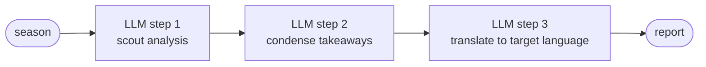
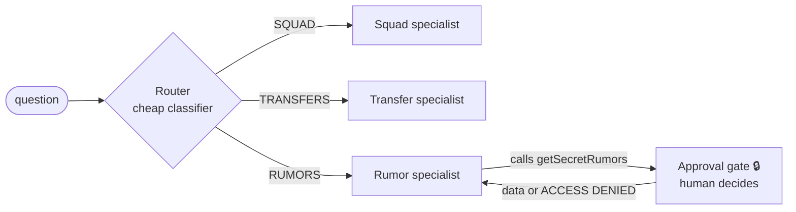
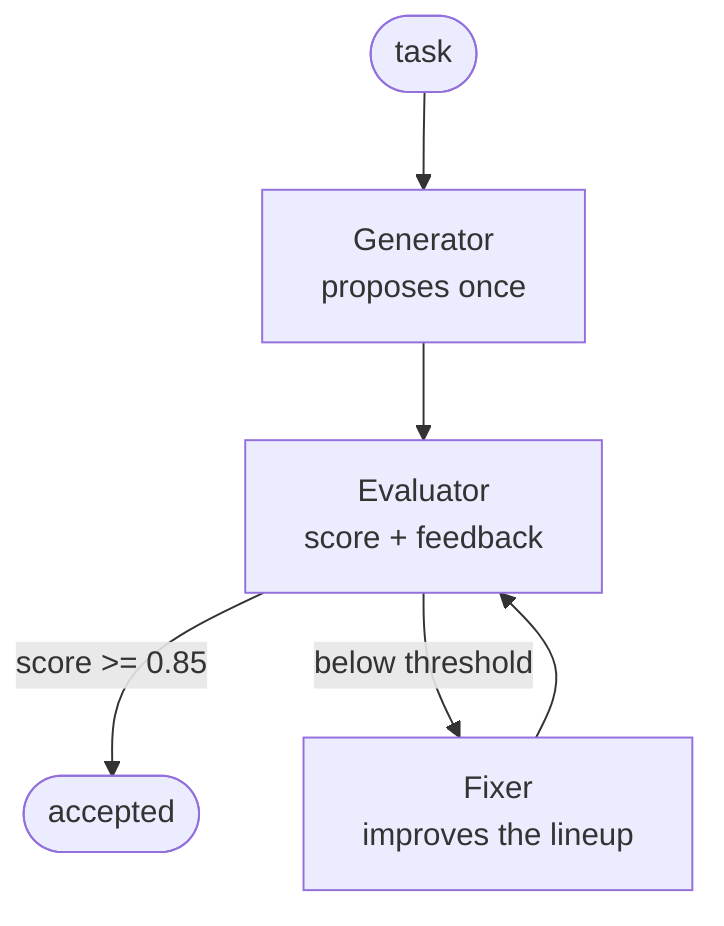
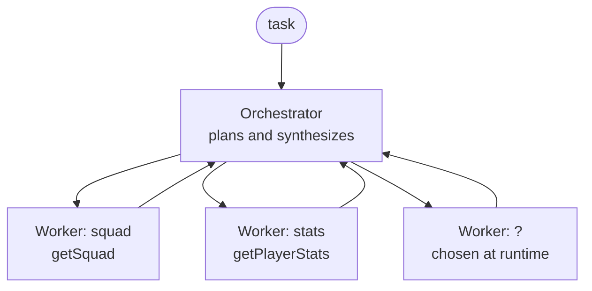

# Agentic Workflow Patterns

Two mirror modules implement the five canonical workflow patterns from
Anthropic's *Building Effective Agents* — same endpoints, same AC Milan
domain, different framework underneath:

| Module | Port | Style |
|--------|------|-------|
| `patterns-langchain4j` | 8087 | Agentic DSL **where it pays off** — `sequenceBuilder`, `conditionalBuilder`, `loopBuilder`; plain Java where it does not |
| `patterns-spring-ai`   | 8088 | Explicit — ChatClient + plain Java (loops, switch, CompletableFuture) |

**Three of the five use the DSL, two deliberately do not.** That is a result,
not an omission: the DSL earns its place where a pattern has *state and a
condition* (chaining, routing, the evaluator loop) and earns nothing where a
pattern only has *concurrency* (parallelization) — there `CompletableFuture`
does the same job and hides less. Orchestrator-workers skips
`supervisorBuilder()` for a different reason, explained below.

One class per pattern, named after the pattern. Agents are Spring beans,
built once in the constructor and injected where needed. Shared domain data
lives in `common` (`MilanKnowledgeBase`); each module exposes it through its
own tool annotations (`@Tool`/`@P` in LC4j, `@Tool`/`@ToolParam` in Spring AI):
`getSquad(year)`, `getPlayerStats(name)`, `getTransfers(window)` and
`getSecretRumors()` 🔒 — the last one gated by human approval
(`common/approval`, decided at http://localhost:3000/approvals).

**Endpoints (identical on both ports):**

| Pattern | Endpoint | Example |
|---------|----------|---------|
| 1. Prompt chaining | `GET /api/v1/patterns/chain?season=&language=` | `?season=2007&language=Polish` |
| 2. Routing | `POST /api/v1/patterns/routing` | body: `"Show me the latest transfer rumors."` |
| 3. Parallelization | `GET /api/v1/patterns/parallel` | — |
| 4. Evaluator-optimizer | `GET /api/v1/patterns/evaluator?season=` | `?season=2007` |
| 5. Orchestrator-workers | `POST /api/v1/patterns/orchestrator` | body: `"compare the 2007 and 2024 squads"` |

The Chat UI has a **Patterns Lab** page (http://localhost:3000/patterns) that
runs each pattern against BOTH modules at once and shows the answers side by
side with execution times, next to a diagram of the flow. Each result panel
labels what the implementation actually is, per pattern — not a blanket
"Agentic DSL" that would be true for three of them and false for two.

Rule of thumb (Anthropic): **use the simplest pattern that works** —
escalate chain → routing → parallel → evaluator → orchestrator only when
the previous one is not enough; full autonomy is the last resort.

---

## 1. Prompt chaining (sequence)

Output of step N feeds step N+1. The decomposition is designed by YOU,
not the model. Each step can use its own prompt, model and validation.

- **LC4j**: `AgenticServices.sequenceBuilder().subAgents(scout, condenser, translator)` — shared state via `outputKey`; the language enters the state as `@V("language")`.
- **Spring AI**: three consecutive `chatClient.prompt()...call()` calls — no workflow API, the pattern *is* the code.
- **Where the DSL pays**: without it you thread the result of step N into step
  N+1 by hand, and the language has to be carried through three methods. With
  `outputKey` the state is named and flows on its own.
- **Language switch**: `language` accepts any of English (default), Polish,
  Romanian, Hindi, Dutch, Greek, Turkish — or `Mixed`, which
  `TranslationLanguages.resolve()` turns into an instruction to blend **all**
  of them in one text. Nothing in the workflow changes; only the string
  injected into the last link. That is the pattern's whole point: links are
  independent, so you can swap one without touching the others.
- **Trace signature**: a staircase — sequential `chat` spans, each starting when the previous ends.

## 2. Routing

A cheap classifier picks the specialist. Separation of concerns: the
transfer specialist has different prompts/tools than the squad specialist;
the router only needs to recognize, not answer.

- **LC4j**: the Agentic DSL end to end — `conditionalBuilder()` with predicates
  over shared state, composed by `sequenceBuilder()`. The router writes a route
  into the state and each branch declares the predicate that selects it; there
  is no `switch` anywhere.
- **Spring AI**: one cheap call with structured output, then a `switch` on the
  enum. Note: a *bare* enum (`.entity(Route.class)`) is fragile — models wrap
  the value in quotes or JSON and the converter throws. Wrapping it in a record
  (`RouteChoice`) gives the converter a proper schema; a string-parsing
  fallback keeps the router alive either way.
- **Where the DSL pays**: routing is a decision over shared state, which is
  exactly what `conditionalBuilder` expresses. Rewriting it from the original
  `switch` cost nothing in latency and kept the `toolProvider` — so tool spans
  and the approval gate still work, which was the only real risk.
- **Approval gate order**: the gate sits **after** the specialist, not before
  it. The specialist decides the secret tool is needed; only then does
  `getSecretRumors()` block on human approval and return the data — or
  `ACCESS DENIED`, which the model relays to the user as a refusal.
- **Prompt lesson**: a specialist prompt must *command*, not suggest.
  "Use getSecretRumors" made the model answer *"Yes, I can check that —
  would you like me to?"* and the gate never fired. The prompt now forbids
  offers explicitly and states that calling the gated tool **is** the way to
  ask for permission.
- **Trace signature**: one SHORT `chat` (router) + one LONG `chat` (specialist).

## 3. Parallelization

Independent subtasks run concurrently; code (or a final LLM call)
aggregates. Two flavours: *sectioning* (different work per branch) and
*voting* (same task N times, take the median).

- **Both modules use plain `CompletableFuture`** around AiServices / ChatClient
  scorers. This is the one pattern implemented identically on both sides, on
  purpose: the DSL adds nothing to a fan-out, and identical code makes the
  comparison clean — whatever differs in the output comes from the model, not
  the framework.
- **Trace signature**: OVERLAPPING `chat` spans with a common start — the only pattern where the waterfall stops being a staircase.
- **Structured output is best-effort.** `gpt-4o-mini` occasionally returns a
  partial object; the Spring AI branch retries once with a blunter prompt and,
  failing that, records 0.0 with an explicit rationale rather than silently
  ranking the wrong candidate. A branch that throws — timeout, 429 — is caught
  per branch, because `join()` would otherwise turn one failed candidate out of
  five into a 500 for the whole request.
- Practical note: this pattern is why we migrated to OpenRouter — a local single-GPU/CPU Ollama serializes inference and hides the parallelism.

## 4. Evaluator-optimizer (loop)

A generator produces a solution **once**; an evaluator scores it against
explicit criteria and returns feedback; a fixer improves the SAME solution
until the score passes a threshold or the iterations run out. The only
workflow pattern with a cycle.

- **LC4j**: `loopBuilder().subAgents(scorer, fixer).maxIterations(4).exitCondition(scope -> scope.readState("score", 0.0) >= 0.85)`
- **Spring AI**: a hand-written `for` with a structured-output evaluator
  (`record Evaluation(double score, String feedback)`) and an `if` on the
  threshold. The sharpest DSL-vs-Java contrast in the whole set: an exit
  *condition* versus a place in the control flow.
- **The two modules ran different algorithms for a while.** Spring AI
  regenerated the lineup from scratch on every lap while LangChain4j proposed
  once and only fixed — the same label over different work, which made the
  side-by-side timings meaningless (18.6 s versus 6.4 s). They now match; the
  hand-written loop stays, because *that* is the contrast worth showing, not
  the algorithm inside it.
- **The evaluator was scoring blind.** It was asked to check "uses only listed
  players" while the squad list went to the generator only. Unverifiable
  criterion, defensive scoring, threshold never reached, four iterations every
  time — visible as a permanent "Best effort after 4 iterations" and, in the
  metrics, as roughly twice the calls and tokens of the twin.
- **0.85 is a demo parameter, not a quality bar.** It sits deliberately in the
  gap between what the scoring rules grant a correct lineup (0.8) and what they
  grant one that also lists shirt numbers and states the formation (0.9), so
  the first pass fails, the fixer adds exactly those two things, and the second
  or third pass clears the bar. At 0.8 the loop exits immediately and the
  pattern demonstrates nothing. The value lives in **three** places: both
  `THRESHOLD` constants and the flow diagram in `chat-ui`.
- **Trace signature**: one `chat` (generator), then N repetitions of a
  score+fix pair. The Spring AI side wraps each lap in an
  `evaluator_iteration N` span carrying `evaluator.score`, so the waterfall
  shows quality converging. The LangChain4j side cannot: the loop lives inside
  `loopBuilder()` and there is no callback to hook — the same trade as always,
  one level down.

## 5. Orchestrator-workers

A central LLM PLANS AT RUNTIME: decomposes the task into subtasks that
couldn't be hardcoded, delegates to workers, synthesizes. Versus
parallelization: there you wrote the branches; here the orchestrator
invents them per request.

- **LC4j**: orchestrator-as-agent — one AiServices agent whose workers are the
  Milan tools; the model plans inside a single conversation
  (`supervisorBuilder()` is the heavier DSL variant with full sub-agents, left
  out on purpose so the two readings stay distinguishable).
- **Spring AI**: an explicit pipeline — planner call with structured output (a
  `Plan` record) → one worker call per subtask → synthesis call.
- **The timings are NOT comparable here**, and the UI says so under the
  results. LangChain4j plans in-conversation (~2 LLM calls); Spring AI runs
  planner → workers → synthesis (~10 calls, measured 17.4 s versus 4.8 s).
  Two valid readings of the same pattern, doing different amounts of work —
  presenting the difference as a framework benchmark would be dishonest.
- **Trace signature**: irregular — a tool sequence you did NOT know in
  advance; every run may produce a different shape. 63 spans versus 7 on the
  same request.

---

## Gotchas

- **Agent interfaces in the Agentic DSL must be `public`.** The runtime calls
  them reflectively from another package (`AgentInvoker` → `Method.invoke`)
  without `setAccessible()`, so a package-private nested interface fails with
  `IllegalAccessException: ... cannot access a member ... with modifiers
  "public abstract"` — confusing, because the *method* is public; what matters
  is the visibility of the declaring interface. Plain `AiServices` is
  unaffected (it goes through a proxy).
- **`-parameters` compiler flag.** `spring-boot-starter-parent` sets it for
  you; a custom parent must do it explicitly, otherwise `@RequestParam` without
  an explicit name fails at runtime ("Name for argument of type [int] not
  specified"). Both controllers name their parameters explicitly anyway.
- **An asymmetric prompt makes a comparison meaningless.** Two of the five
  patterns quietly drifted apart — the evaluator by algorithm, parallelization
  by prompt wording — and in both cases the side-by-side timings kept looking
  authoritative. When the point of a module is comparison, the prompts are part
  of the contract, not an implementation detail.

## Cross-cutting

- **Autonomous agent** (the model decides everything in a loop) is the
  baseline implemented three times elsewhere in this repo
  (raw-agent / AiServices / ChatClient) — the patterns above exist
  precisely so you *don't* need it for every problem. `multimodal-lab` is the
  fourth variant and the most extreme: five tools, no plan of ours at all, the
  loop owned entirely by `ToolCallingAdvisor`.
- **Who owns the loop is the real question.** In `patterns-spring-ai` we write
  it, so `MAX_ITERATIONS` is on the first line. In `multimodal-lab` the
  framework writes it, and there is no iteration limit at all — a failing tool
  was once called over a hundred times in one turn. Delegating the loop means
  the stop condition becomes your job in a place where nothing reminds you of
  it.
- **Human-in-the-loop** is not a flow pattern but a gate spliced into one:
  here it guards `getSecretRumors()` in both modules via the shared
  `HumanApprovalService.gate(...)` from `common`, with the same REST contract
  and UI as mcp-server. The guarded work is passed as a lambda, so a tool
  *cannot* execute it without a decision.
- **Observability**: all five patterns inherit tracing + GenAI metrics from
  `common`; recognizing a pattern by its Tempo waterfall is the best
  single demo in the series.
