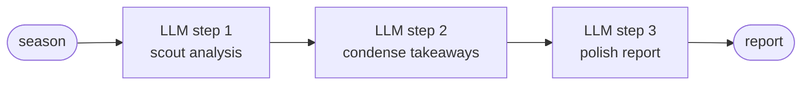
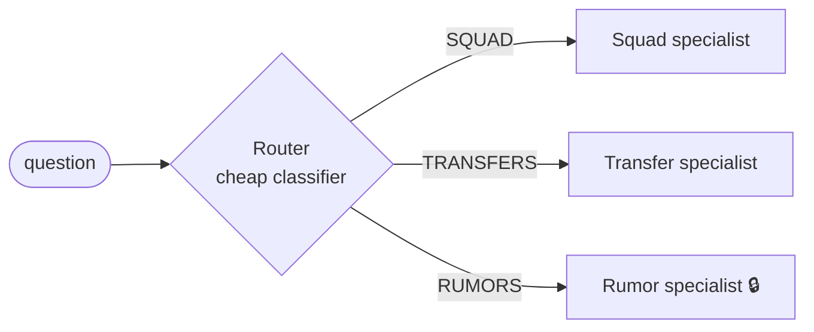
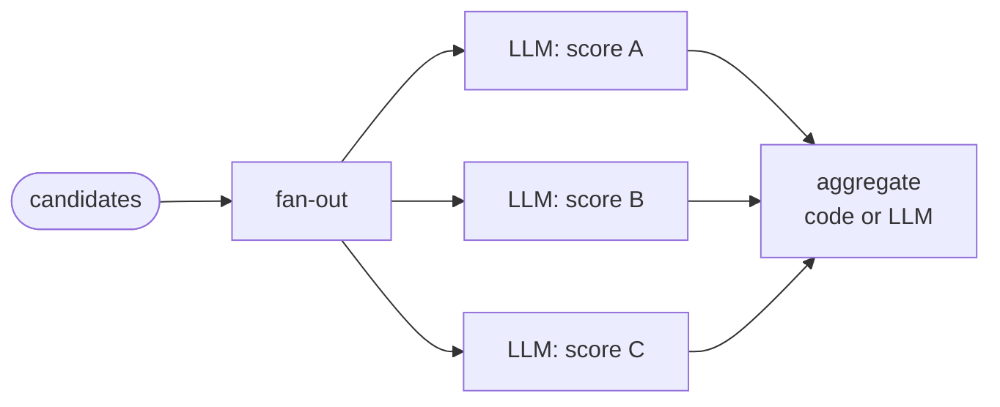
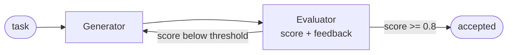
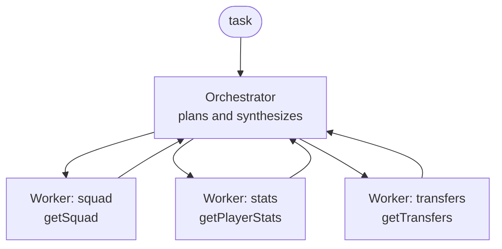

# Agentic Workflow Patterns

Two mirror modules implement the five canonical workflow patterns from
Anthropic's *Building Effective Agents* — same endpoints, same AC Milan
domain, different framework underneath:

| Module | Port | Style |
|--------|------|-------|
| `patterns-langchain4j` | 8087 | Declarative — AiServices interfaces + Agentic DSL (`sequenceBuilder`, `loopBuilder`) |
| `patterns-spring-ai`   | 8088 | Explicit — ChatClient + plain Java (loops, switch, CompletableFuture) |

One class per pattern, named after the pattern. Agents are Spring beans,
built once in the constructor and injected where needed. Shared domain data
lives in `common` (`MilanKnowledgeBase`); each module exposes it through its
own tool annotations (`@Tool`/`@P` in LC4j, `@Tool` in Spring AI):
`getSquad(year)`, `getPlayerStats(name)`, `getTransfers(window)`,
`getSecretRumors()` 🔒 (approval-flow candidate).

**Endpoints (identical on both ports):**

| Pattern | Endpoint | Example |
|---------|----------|---------|
| 1. Prompt chaining | `GET /api/v1/patterns/chain?season=` | `?season=2007` |
| 2. Routing | `POST /api/v1/patterns/routing` | body: `"who played midfield in 2007?"` |
| 3. Parallelization | `GET /api/v1/patterns/parallel` | — |
| 4. Evaluator-optimizer | `GET /api/v1/patterns/evaluator?season=` | `?season=2007` |
| 5. Orchestrator-workers | `POST /api/v1/patterns/orchestrator` | body: `"compare the 2007 and 2024 squads"` |

Rule of thumb (Anthropic): **use the simplest pattern that works** —
escalate chain → routing → parallel → evaluator → orchestrator only when
the previous one is not enough; full autonomy is the last resort.

---

## 1. Prompt chaining (sequence)

Output of step N feeds step N+1. The decomposition is designed by YOU,
not the model. Each step can use its own prompt, model and validation.

- **LC4j**: `AgenticServices.sequenceBuilder().subAgents(scout, condenser, translator)` — shared state via `outputKey`.
- **Spring AI**: three consecutive `chatClient.prompt()...call()` calls — no workflow API, the pattern *is* the code.
- **Trace signature**: a staircase — sequential `chat` spans, each starting when the previous ends.

## 2. Routing

A cheap classifier picks the specialist. Separation of concerns: the
transfer specialist has different prompts/tools than the squad specialist;
the router only needs to recognize, not answer.

- **LC4j**: AiServices router returning an **enum** + explicit `switch`
  (the DSL alternative is `conditionalBuilder()` with state predicates).
- **Spring AI**: one cheap call with structured output — `.entity(Route.class)` — then `switch`.
- **Trace signature**: one SHORT `chat` (router) + one LONG `chat` (specialist).

## 3. Parallelization

Independent subtasks run concurrently; code (or a final LLM call)
aggregates. Two flavours: *sectioning* (different work per branch) and
*voting* (same task N times, take the median).

- **LC4j**: parallel agents / `CompletableFuture` around AiServices scorers.
- **Spring AI**: `CompletableFuture.supplyAsync(...)` × N + `allOf().join()` — elegant on virtual threads.
- **Trace signature**: OVERLAPPING `chat` spans with a common start — the only pattern where the waterfall stops being a staircase.
- Practical note: this pattern is why we migrated to OpenRouter — a local single-GPU/CPU Ollama serializes inference and hides the parallelism.

## 4. Evaluator-optimizer (loop)

Generator creates, evaluator scores against criteria, feedback loops back —
until the score passes a threshold or iterations run out. The only workflow
pattern with a cycle.

- **LC4j**: `loopBuilder().subAgents(scorer, fixer).maxIterations(4).exitCondition(scope -> scope.readState("score", 0.0) >= 0.8)` — the sharpest DSL-vs-Java contrast in the whole set.
- **Spring AI**: a manual `while` with a structured-output evaluator (`record Evaluation(double score, String feedback)`).
- **Trace signature**: N repetitions of a `chat`+`chat` pair; put the score in a span attribute and you can watch quality converge on the waterfall.

## 5. Orchestrator-workers

A central LLM PLANS AT RUNTIME: decomposes the task into subtasks that
couldn't be hardcoded, delegates to workers, synthesizes. Versus
parallelization: there you wrote the branches; here the orchestrator
invents them per request.

- **LC4j**: orchestrator-as-agent — AiServices agent whose workers are the
  Milan tools (`supervisorBuilder()` is the heavier DSL variant with full
  sub-agents).
- **Spring AI**: planner call with structured output (a `Plan` record) →
  workers with tools → synthesis call.
- **Trace signature**: irregular — a tool sequence you did NOT know in
  advance; every run may produce a different shape.

---

## Cross-cutting

- **Autonomous agent** (the model decides everything in a loop) is the
  baseline implemented three times elsewhere in this repo
  (raw-agent / AiServices / ChatClient) — the patterns above exist
  precisely so you *don't* need it for every problem.
- **Human-in-the-loop** (Approval Flow, see mcp-server) is not a flow
  pattern but a gate you can splice into any of the above — natural spot
  here: `getSecretRumors()` and accepting the evaluator's final squad.
- **Observability**: all five patterns inherit tracing + GenAI metrics from
  `common`; recognizing a pattern by its Tempo waterfall is the best
  single demo in the series.
